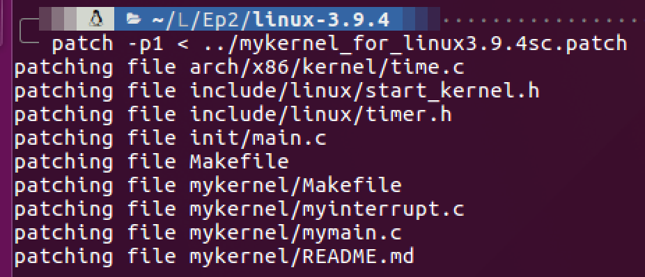
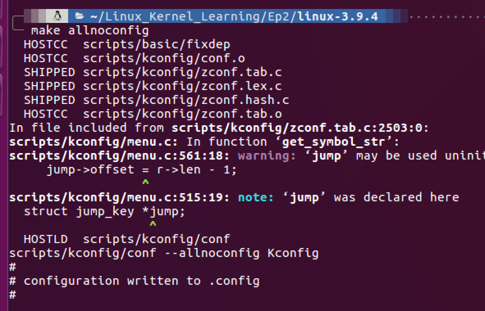
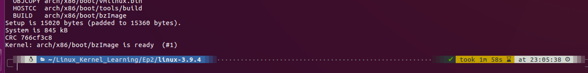
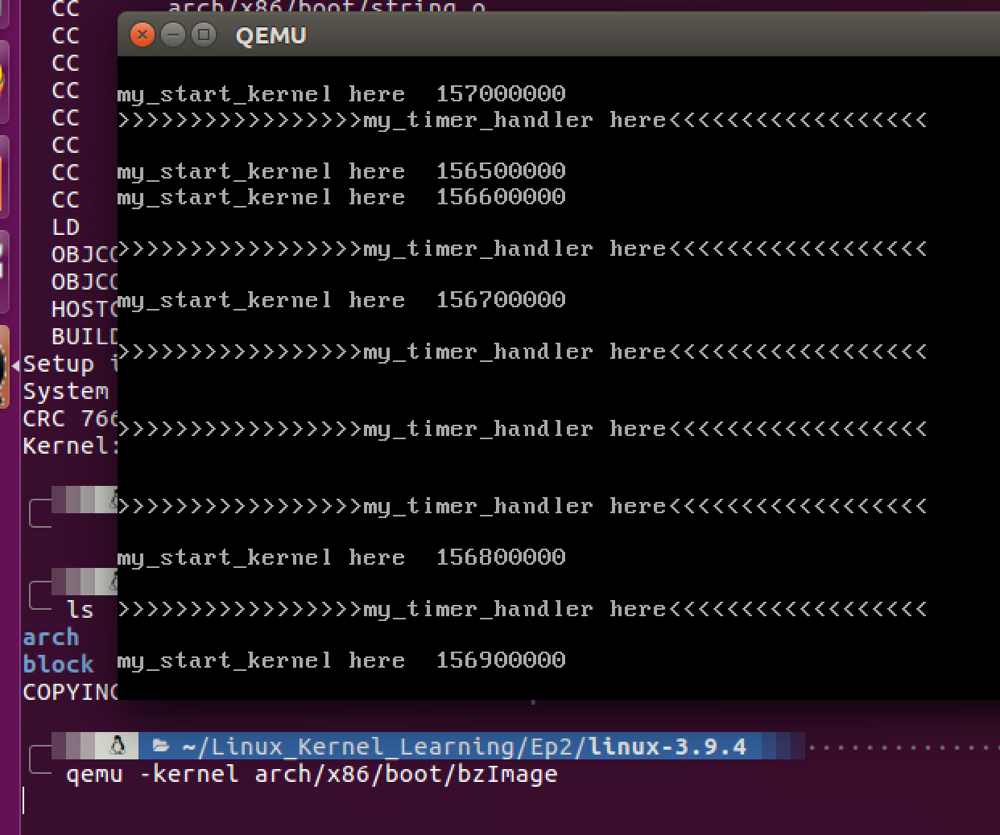
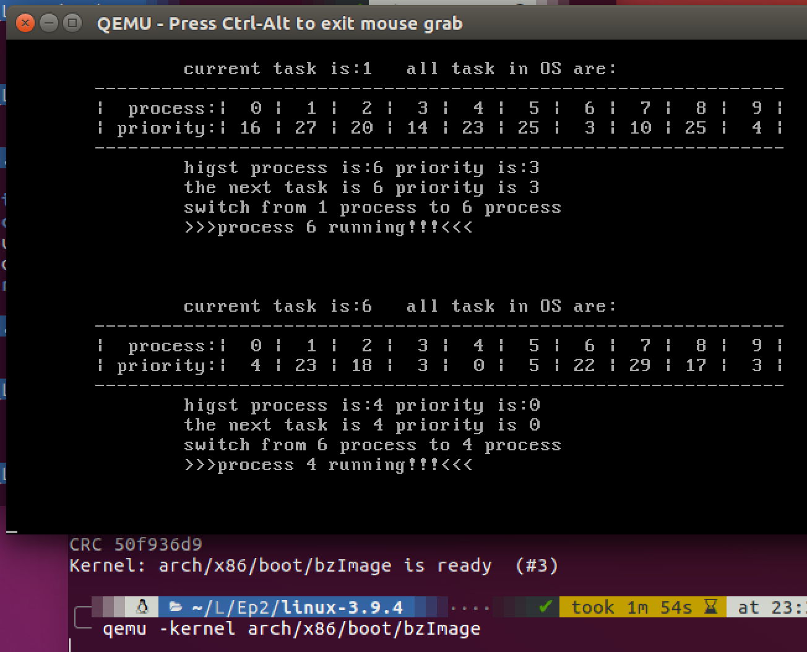

# compile a small kernel program

Set up environment:

```bash
# Install qemu
sudo apt-get install qemu
sudo ln -s /usr/bin/qemu-system-i386 /usr/bin/qemu
# Download kernel source archive
wget https://mirrors.edge.kernel.org/pub/linux/kernel/v3.x/linux-3.9.4.tar.xz
# Download mykernel patch
wget https://raw.githubusercontent.com/mengning/mykernel/master/mykernel_for_linux3.9.4sc.patch
# Uncompress the archive
xz -d linux-3.9.4.tar.xz
tar -xvf linux-3.9.4.tar
```

Patch mykernel:

```bash
# Patch mykernel
cd linux-3.9.4
patch -p1 < ../mykernel_for_linux3.9.4sc.patch
```



Set compile config:

```bash
# Set compile config
make allnoconfig
```



Compile mykernel:

```bash
# Compile mykernel
make
```



Use qemu to start mykernel:

```bash
# Start mykernel os
qemu -kernel arch/x86/boot/bzImage
```



Update a newer kernel:


