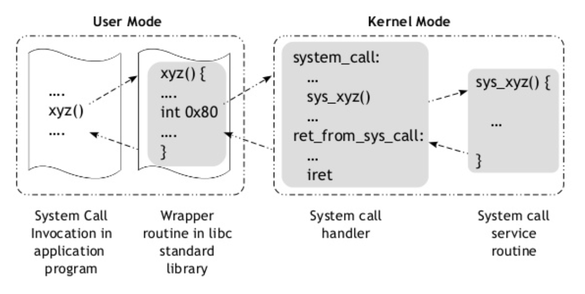

# how system call interrupt process

Firstly, invoke system call `xyz()` in application program. In the function, software interrupt insruction `int 0x80` is wrapped in libc. Interrupt leads to system call handler in kernel which calls `sys_xyz()`. After system call service, the program resume the stack and continue to execute the next instruction.

```
 User Mode  ==> level 3
Kernel Mode ==> level 0
```


